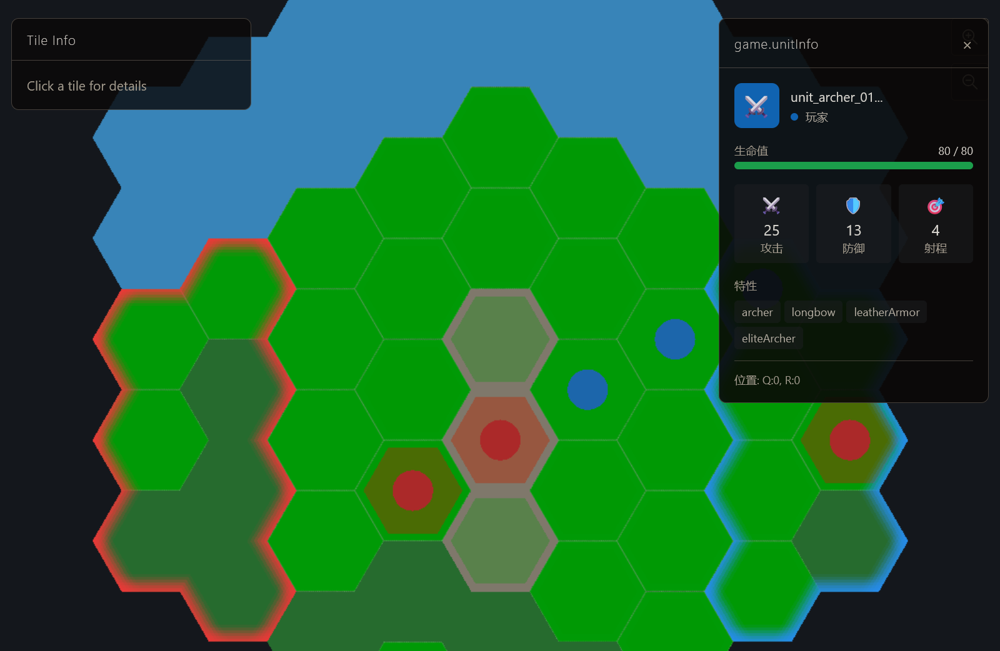

# Conquistador


This project is currently a work in progress!

[English](#english) | [中文](#中文)



---

## English

### Overview

Conquistador is a hexagonal strategy game engine built with PlayCanvas 2D, TypeScript, and Vue 3. It features a scene editor, turn-based combat system, and supports both single-player and hotseat multiplayer modes.

### Tech Stack

- **Frontend**: TypeScript + Vue 3 + Vite
- **Renderer**: PlayCanvas 2D
- **State Management**: Pinia
- **Routing**: Vue Router
- **Backend**: Express (for scene/game save API)
- **Styling**: Tailwind CSS + PostCSS

### Quick Start

```bash
# Install dependencies
npm install

# Run development server (frontend only)
npm run dev

# Run backend API server only
npm run server

# Run both frontend and backend
npm run dev:all
```

Visit `http://localhost:5173` after starting the dev server.

### Available Scripts

| Command | Description |
|---------|-------------|
| `npm run dev` | Start Vite dev server |
| `npm run server` | Start Express API server |
| `npm run dev:all` | Run both frontend and backend |
| `npm run build` | Build for production |
| `npm run preview` | Preview production build |
| `npm run lint` | Run ESLint |
| `npm run typecheck` | Run TypeScript type check |

### Key Features

- **Hexagonal Grid**: Axial coordinate system with neighbor/triangle calculations
- **Scene Editor**: Visual editor for creating terrain, units, and edges
- **Turn-based Combat**: Movement, attack range, and combat resolution
- **Hotseat Multiplayer**: Local multiplayer support
- **Dynamic Attributes**: Unit stats scale with HP (configurable via JSON)

### Debug Mode

Add `?debug=module` to URL to enable debug logs:
- `?debug=combat` - Combat system logs
- `?debug=movement` - Movement system logs
- `?debug=selection` - Selection system logs
- `?debug=edge` - Edge system logs (editor)
- `?debug=all` - All debug logs

### Routes

| Path | Description |
|------|-------------|
| `/` | Home page - Game mode selection |
| `/game` | Game page - Play mode |
| `/editor` | Editor page - Custom map editor |
| `/beta` | Beta features entry |
| `/beta/pathfinding` | Pathfinding test |
| `/beta/movement-range` | Movement range test |

---

## 中文

### 项目简介

Conquistador 是一个基于 PlayCanvas 2D 的六边形策略游戏引擎，使用 TypeScript 和 Vue 3 构建。包含场景编辑器、回合制战斗系统，支持单人模式和热座多人模式。

### 技术栈

- **前端**: TypeScript + Vue 3 + Vite
- **渲染器**: PlayCanvas 2D
- **状态管理**: Pinia
- **路由**: Vue Router
- **后端**: Express（提供场景/存档 API）
- **样式**: Tailwind CSS + PostCSS

### 快速开始

```bash
# 安装依赖
npm install

# 运行开发服务器（仅前端）
npm run dev

# 运行后端 API 服务器
npm run server

# 同时运行前端和后端
npm run dev:all
```

启动后访问 `http://localhost:5173`。

### 可用脚本

| 命令 | 说明 |
|------|------|
| `npm run dev` | 启动 Vite 开发服务器 |
| `npm run server` | 启动 Express API 服务器 |
| `npm run dev:all` | 同时运行前端和后端 |
| `npm run build` | 构建生产版本 |
| `npm run preview` | 预览生产版本 |
| `npm run lint` | 运行 ESLint 检查 |
| `npm run typecheck` | 运行 TypeScript 类型检查 |

### 核心功能

- **六边形网格**: 使用轴坐标系统，支持邻居/三角形计算
- **场景编辑器**: 可视化编辑地形、单位、边元素
- **回合制战斗**: 移动、攻击范围、战斗结算
- **热座多人模式**: 本地多人对战支持
- **动态属性**: 单位属性随 HP 变化（通过 JSON 配置）

### 调试模式

在 URL 中添加 `?debug=module` 启用调试日志：
- `?debug=combat` - 战斗系统日志
- `?debug=movement` - 移动系统日志
- `?debug=selection` - 选择系统日志
- `?debug=edge` - 边系统日志（编辑器）
- `?debug=all` - 所有调试日志

### 路由

| 路径 | 说明 |
|------|------|
| `/` | 主页 - 游戏模式选择 |
| `/game` | 游戏页面 - 游戏模式 |
| `/editor` | 编辑器页面 - 自定义地图编辑器 |
| `/beta` | Beta 功能入口 |
| `/beta/pathfinding` | 路径查找测试 |
| `/beta/movement-range` | 移动力范围测试 |